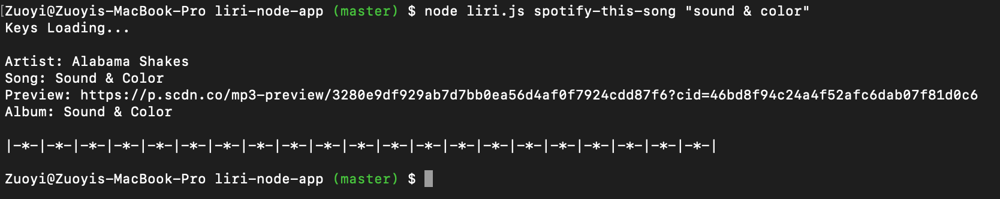
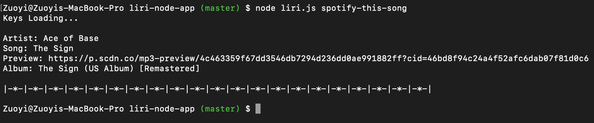
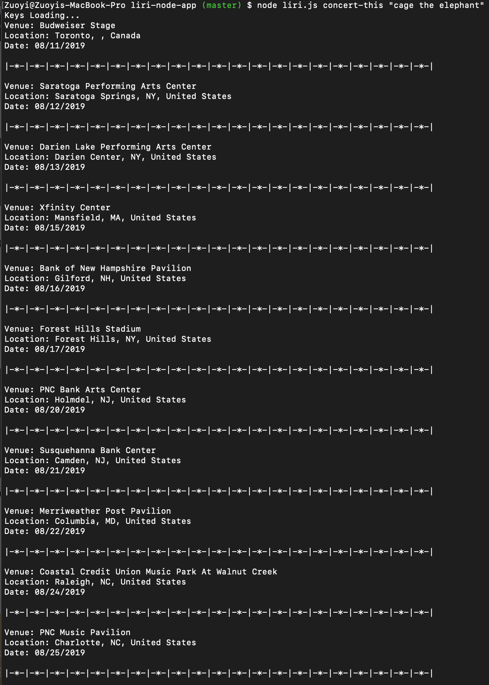
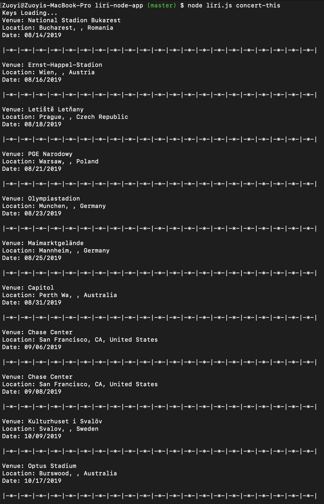
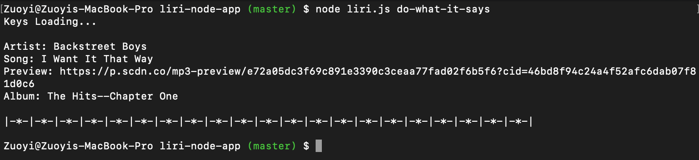
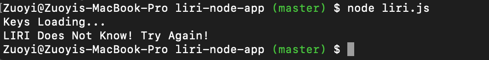
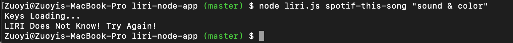

# liri-node-app

Created by Zuoyi Phang

## Introduction

### About

LIRI Bot is a command-line node application designed to allow users to easily search for information on songs, movies, and concerts. The user may run one of the four functions listed below. Results will be printed to the console as well as saved in a text file (log.txt).

## Methods Used:

- Node.JS
- fs
- OMDB API
- Node-Spotify-API
- BandsInTown API
- Moment
- Axios
- DotEnv

## Spotify Usage:

`node liri.js spotify-this-song ""`
Using the Spotify API, the user inputs the command `spotify-this-song` in addition to their desired song title, the data that returns includes the Name of the Artist/Artists, the Song Title, the Preview Url (only if it is available), and the Album Name.
Here you can see when "Sound & Color" is searched:

If the user did not enter a specific song then the default song "Ace of Base - The Sign" will be shown.

## BandsInTown Usage:

`node liri.js concert-this`
Using the BandsInTown API, the user is able to search upcomming concerts by giving the command `concert-this` in addition to their desired Artist. The data that returns include the Venue Name, Venue Location, and the Date of the Concert. Here you can see when "Cage the Elephant" is searched:

If the user did not enter a specific song then the default Artist "Metalica" will be shown.

## Read Instruction from File:

`node liri.js do-what-it-says`
The command `do-what-it-says` displays the message that is written in the random.txt file and runs the command that is written inside that file.

## Error Message:

When the user inputs an invalid command, they will recieve a "LIRI Does Not Know! Try Again!" message. Here you can see what is displayed when you do not give a command at all:

Here you will see when `spotify-this-song-` is misspelled.

